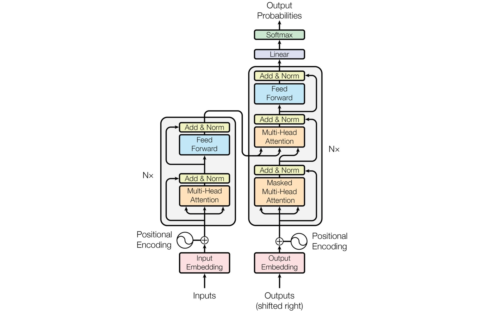

# TransformerSummarization

基于Transformer的生成式文本摘要模型，基于Mxnet/gluon。

## 使用说明

大部分超参数可以在 [hyper_parameters.py](code/hyper_parameters.py) 文件中进行设置。

### 训练

设置完参数之后，运行 [train.py](code/train.py) 文件。

### 简单测试效果

运行 [summarize.py](code/summarize.py) 文件，按照提示输入原文，可根据训练结果调整测试时加载的模型轮次。
